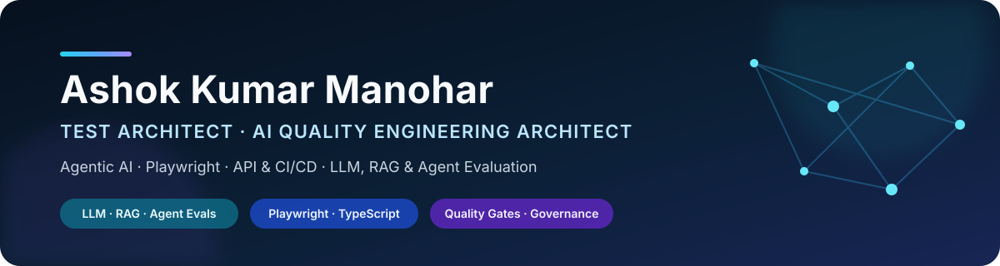
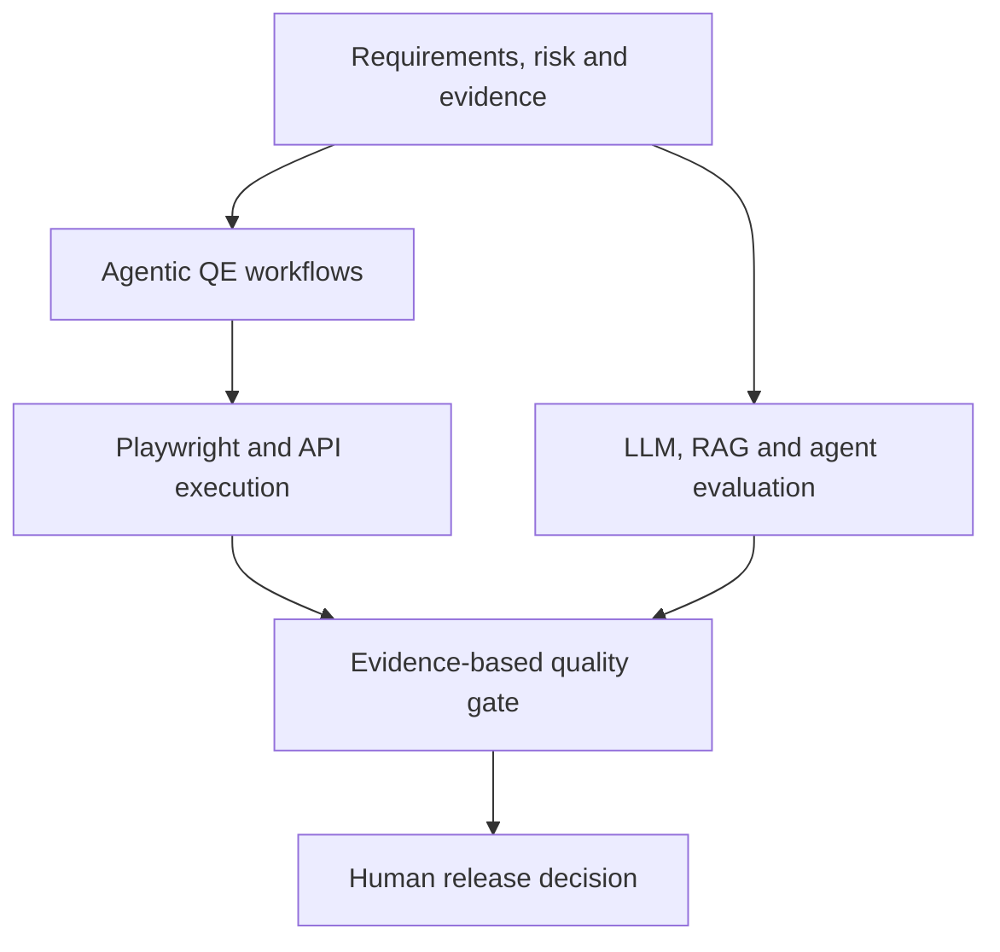

  

<h2 align="center">Test Architect | AI Quality Engineer | Playwright, API &amp; CI/CD | LLM, RAG &amp; Agent Evaluation</h2>

<strong>Enterprise test architecture with measurable AI-quality differentiation</strong>

  
  
  

## About me

I am a **Test Architect and AI Quality Engineer** focused on making nondeterministic software systems measurable, testable, secure, observable, and releasable.

My work connects **LLM, RAG, agent and MCP evaluation** with the engineering disciplines required to ship dependable products: Playwright automation, API and contract testing, performance and reliability engineering, security controls, observability, CI/CD quality gates, and human governance.

> **Evidence first. AI assists engineering decisions; it does not replace engineering controls.**

## Engineering proof

| Agentic quality engineering | AI agent evaluation | RAG evaluation | Failure triage |
| :---: | :---: | :---: | :---: |
| **9** governed QE agents | **70** curated evaluation cases | **80** retrieval and generation cases | **80** controlled triage cases |
| Human approval and audit history | Task, tool, trajectory and safety checks | 24 versioned documents and hybrid retrieval | Precision, recall, F1 and calibration gates |

These are reproducible, synthetic portfolio datasets and reference implementations—not customer data or production claims.

## Featured engineering work

| Priority | Project | Recruiter evidence |
| ---: | --- | --- |
| **1** | **[Playwright Enterprise Test Framework](https://github.com/ashokmanohar-ai/playwright-enterprise-test-framework)** | Strict TypeScript, UI/API/integration automation, cross-browser sharding, accessibility, visual checks, Docker, evidence-rich CI and a governed quality gate |
| **2** | **[Enterprise AI Quality Engineering Platform](https://github.com/ashokmanohar-ai/enterprise-ai-quality-engineering-platform)** | DeepEval, Ragas, Promptfoo, LLM/RAG/agent/MCP evaluation, canonical datasets, hard safety gates, Azure OpenAI and Phoenix-first observability |
| **3** | **[API & Integration Testing Framework](https://github.com/ashokmanohar-ai/api-integration-testing-framework)** | REST, GraphQL, Pact, RBAC, persistence, WireMock fault injection, transactional events, Redpanda, retries and idempotency |
| **4** | **[Agentic Quality Engineering Platform](https://github.com/ashokmanohar-ai/agentic-quality-engineering-platform)** | Nine specialized agents, explicit LangGraph state, deterministic controls, RBAC, audit events, hash-bound human approval and real Playwright execution |
| **5** | **[Continuous Quality Engineering](https://github.com/ashokmanohar-ai/continuous-quality-engineering)** | Functional, contract, accessibility, security and performance evidence combined into transparent release recommendations |
| **6** | **[AI Agent Evaluation Framework](https://github.com/ashokmanohar-ai/ai-agent-evaluation-framework)** | 70 versioned cases across task completion, tool use, trajectory, grounding, safety, approvals, recovery and regression quality |

Each flagship repository provides a recruiter quick tour, a reproducible five-minute proof path and scoped release evidence. Portfolio datasets and demonstrations are explicitly identified as synthetic/reference implementations.

### Broader quality-engineering systems

- **[Performance & Reliability Testing](https://github.com/ashokmanohar-ai/performance-reliability-testing)** — k6 workloads, PostgreSQL, WireMock fault injection, Prometheus/Grafana observability, SLO gates and regression detection.
- **[API & Integration Testing Framework](https://github.com/ashokmanohar-ai/api-integration-testing-framework)** — REST, GraphQL, Pact, RBAC, persistence, asynchronous events, retries, idempotency and Docker-based integration testing.
- **[Continuous Quality Engineering](https://github.com/ashokmanohar-ai/continuous-quality-engineering)** — functional, contract, accessibility, security and performance evidence combined into transparent release recommendations.

## Quality-engineering system map

## Core capabilities

| AI quality and evaluation | Quality engineering and automation | Engineering and platform |
| --- | --- | --- |
| LLM and RAG evaluation Agent trajectory and tool-use testing Golden datasets and regression gates Groundedness, hallucination and citations LLM-as-a-Judge calibration Prompt-injection and excessive-agency testing | Playwright with TypeScript Pytest and structured test architecture REST, GraphQL and Pact contracts Accessibility with Axe Performance and reliability with k6 BDD, traceability and risk-based testing | Python, FastAPI and Pydantic TypeScript, Node.js and Fastify Docker and Docker Compose GitHub Actions and Azure DevOps PostgreSQL and SQLite OpenTelemetry, Phoenix and structured reporting |

### Selected technologies

  
  
  
  
  
  
  
  

## Engineering principles

- **Deterministic before probabilistic:** use schemas, rules, contracts and exact evidence wherever possible.
- **Hard gates remain hard:** critical safety, authorization and correctness failures cannot be averaged away.
- **Human accountability:** high-impact actions and release decisions retain review, approval and audit evidence.
- **Reproducibility:** prefer credential-free offline modes, versioned datasets, Docker and repeatable CI workflows.
- **Transparent limitations:** distinguish demonstrations, synthetic fixtures and mock-provider results from measured live-system quality.

## Current interests

I am continuing to explore agent evaluation, MCP security and conformance, computer-use testing, risk-based regression selection, AI observability, test-data engineering, and production feedback loops for AI quality.

## Connect

- [LinkedIn](https://www.linkedin.com/in/ashok-kumar-manohar/)
- [Explore my public repositories](https://github.com/ashokmanohar-ai?tab=repositories)

Building quality systems that turn AI behaviour into reviewable engineering evidence.

