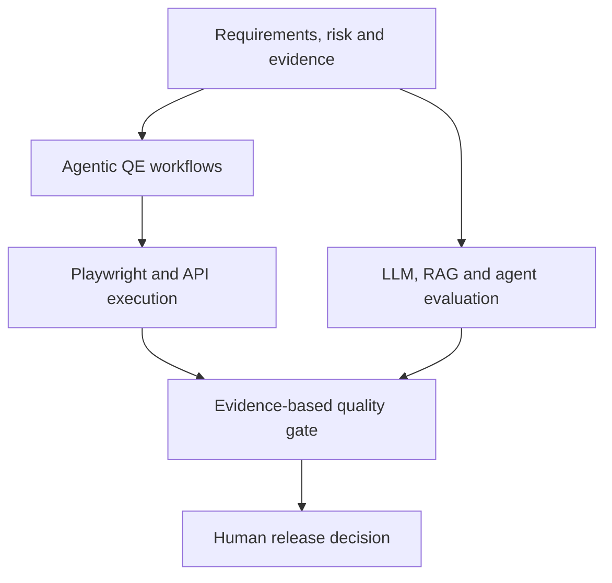

  

<h2 align="center">Test Architect | AI Quality Engineering Architect | Agentic AI, Playwright, API &amp; CI/CD | LLM, RAG &amp; Agent Evaluation</h2>

<strong>Bridging enterprise Quality Engineering and production AI with measurable, reviewable release evidence</strong>

  
  
  

  
  
  

## Recruiter snapshot

I am a **Test Architect and AI Quality Engineering Architect with 14+ years of experience** building enterprise quality-engineering systems across automation, APIs, CI/CD, reliability, and AI evaluation.

- **Selected delivery impact:** reduced escaped defects by **40% year over year**, increased FHIR API coverage from **60% to 95%**, and reduced regression execution from **4 hours to under 60 minutes**.
- **Portfolio maturity:** five stable **v1.0.0** portfolio releases across Playwright, Enterprise AI QE, Agentic QE, API/Integration, and AI Agent Evaluation; RAG and Performance remain CI-validated engineering projects without a formal release claim.
- **Primary role fit:** Test Architect · Quality Engineering Architect · AI Quality Engineering Architect · AI Test Automation Architect.
- **AI delivery alignment:** Agentic AI Engineer · Agentic AI Quality Engineer · Forward Deployed Engineer (AI), supported by portfolio evidence across customer discovery, integration, deployment, evaluation, observability and incident response.
- **Differentiator:** I connect deterministic software-quality engineering—Playwright, API, contract, performance and CI/CD—with **LLM, RAG, agent and MCP evaluation**.
- **Quality model:** AI quality is treated as a continuous engineering control system: **versioned evidence → evaluation → observability → regression → release gates**, not as isolated prompt or benchmark scores.

The delivery outcomes above come from prior enterprise work. Portfolio datasets and demonstrations are explicitly identified as synthetic or reference implementations.

> **Evidence first. AI assists engineering decisions; it does not replace engineering controls.**

## What I architect

| Enterprise QE architecture | AI quality control systems | Governed agentic systems |
| --- | --- | --- |
| Playwright, APIs, contracts, performance, accessibility, CI/CD and release evidence | LLM, RAG, agent and MCP evaluation with datasets, observability, regression and hard gates | Explicit agent state, bounded tools, approvals, auditability, execution controls and measurable agent quality |

**Portfolio standard:** flagship projects provide a recruiter walkthrough, a reproducible verification path, explicit architecture decisions, stable release evidence and transparent limitations.

**Verification index:** [Portfolio Evidence Index](https://github.com/ashokmanohar-ai/ashokmanohar-ai/blob/main/PORTFOLIO_EVIDENCE.md) consolidates merged PRs, test counts, CI validation, security boundaries, release evidence and known limitations across the flagship portfolio.

## 90-second portfolio routes

Choose the route closest to the role you are hiring for:

| Hiring focus | Fastest evidence route |
| --- | --- |
| **Test / QE Architecture** | [Playwright Enterprise Test Framework](https://github.com/ashokmanohar-ai/playwright-enterprise-test-framework) → [API & Integration Testing Framework](https://github.com/ashokmanohar-ai/api-integration-testing-framework) → [Performance & Reliability Testing](https://github.com/ashokmanohar-ai/performance-reliability-testing) |
| **AI Quality Engineering** | [Enterprise AI Quality Engineering Platform](https://github.com/ashokmanohar-ai/enterprise-ai-quality-engineering-platform) → [RAG & LLM Evaluation Lab](https://github.com/ashokmanohar-ai/rag-llm-evaluation-lab) → [AI Agent Evaluation Framework](https://github.com/ashokmanohar-ai/ai-agent-evaluation-framework) |
| **Agentic AI / AI Automation** | [Agentic Quality Engineering Platform](https://github.com/ashokmanohar-ai/agentic-quality-engineering-platform) → [AI Test Failure Triage Agent](https://github.com/ashokmanohar-ai/ai-test-failure-triage-agent) → [QE to Forward Deployed AI Engineer](https://github.com/ashokmanohar-ai/-qe-to-forward-deployed-ai-engineer) |

## Engineering proof

| Agentic quality engineering | AI agent evaluation | RAG evaluation | Failure triage |
| :---: | :---: | :---: | :---: |
| **9** governed QE agents | **70** curated evaluation cases | **80** retrieval and generation cases | **80** controlled triage cases |
| Human approval and audit history | Task, tool, trajectory and safety checks | 24 versioned documents and hybrid retrieval | Precision, recall, F1 and calibration gates |

These are reproducible, synthetic portfolio datasets and reference implementations—not customer data or production claims.

## Featured engineering work

| Priority | Project | Recruiter evidence |
| ---: | --- | --- |
| **1** | **[Playwright Enterprise Test Framework](https://github.com/ashokmanohar-ai/playwright-enterprise-test-framework)** | Strict TypeScript, UI/API/integration automation, cross-browser sharding, accessibility, visual checks, Docker, evidence-rich CI and a governed quality gate |
| **2** | **[Enterprise AI Quality Engineering Platform](https://github.com/ashokmanohar-ai/enterprise-ai-quality-engineering-platform)** | DeepEval, Ragas, Promptfoo, LLM/RAG/agent/MCP evaluation, canonical datasets, hard safety gates, Azure OpenAI and Phoenix-first observability |
| **3** | **[Agentic Quality Engineering Platform](https://github.com/ashokmanohar-ai/agentic-quality-engineering-platform)** | Nine specialized agents, explicit LangGraph state, deterministic controls, RBAC, audit events, hash-bound human approval and real Playwright execution |
| **4** | **[API & Integration Testing Framework](https://github.com/ashokmanohar-ai/api-integration-testing-framework)** | REST, GraphQL, Pact, RBAC, persistence, WireMock fault injection, transactional events, Redpanda, retries and idempotency |
| **5** | **[RAG & LLM Evaluation Lab](https://github.com/ashokmanohar-ai/rag-llm-evaluation-lab)** | Hybrid retrieval, reranking, groundedness, hallucination, citation, latency, token, cost and regression evaluation with reproducible evidence |
| **6** | **[Performance & Reliability Testing](https://github.com/ashokmanohar-ai/performance-reliability-testing)** | k6 workload engineering, SLO gates, fault injection, Prometheus/Grafana observability and automated regression detection |

Each flagship repository provides a recruiter quick tour, a reproducible five-minute proof path and scoped release evidence. Portfolio datasets and demonstrations are explicitly identified as synthetic/reference implementations.

## Portfolio scope

The six projects above are my **current flagship engineering portfolio** and are the best representation of my present architectural level. Other public repositories are intentionally separated by purpose so that older learning history is not confused with current role-readiness evidence.

| Portfolio tier | Purpose | Representative repositories |
| --- | --- | --- |
| **Flagship — evaluate me here first** | Current architect-level engineering proof | Playwright Enterprise Test Framework · Enterprise AI Quality Engineering Platform · Agentic Quality Engineering Platform · API & Integration Testing Framework · RAG & LLM Evaluation Lab · Performance & Reliability Testing |
| **Supporting engineering systems** | Deeper evidence around AI evaluation, failure analysis and continuous quality | [AI Agent Evaluation Framework](https://github.com/ashokmanohar-ai/ai-agent-evaluation-framework) · [AI Test Failure Triage Agent](https://github.com/ashokmanohar-ai/ai-test-failure-triage-agent) · [Continuous Quality Engineering](https://github.com/ashokmanohar-ai/continuous-quality-engineering) |
| **Guides and focused learning assets** | Technical education, experiments and skill development | Claude Code · GitHub Copilot · OpenAI Codex · LangGraph/Playwright/AI learning labs and similar focused guides |
| **Historical learning repositories** | Earlier tools, tutorials, forks and technology exploration retained as career history | Earlier Postman, Appium, Katalon, Selenium, cloud, data-science and introductory repositories; these are not presented as my current architectural standard |

For senior-role evaluation, I recommend starting with the **flagship tier** and the [Portfolio Evidence Index](https://github.com/ashokmanohar-ai/ashokmanohar-ai/blob/main/PORTFOLIO_EVIDENCE.md).

## Architect and delivery signal

My portfolio is intentionally organized around the responsibilities expected beyond individual test implementation:

- **Architecture:** reusable test architecture, service boundaries, contracts, configuration, evidence pipelines and quality gates.
- **Engineering governance:** deterministic controls, explicit failure modes, least-privilege patterns, human approval and auditable release decisions.
- **Technical leadership:** reference architectures, engineering standards, technology evaluation, interview-ready design rationale and reusable implementation patterns.
- **Customer-facing delivery:** problem framing, solution architecture, integration design, measurable success criteria, demos, operational troubleshooting and handover thinking.
- **Production mindset:** CI/CD, containers, observability, reliability, security boundaries, cost/latency awareness and clear separation between reference implementations and production claims.

## Broader quality-engineering systems

- **[AI Agent Evaluation Framework](https://github.com/ashokmanohar-ai/ai-agent-evaluation-framework)** — 70 versioned cases covering task completion, tool use, trajectories, grounding, safety, approvals, recovery and regression quality.
- **[AI Test Failure Triage Agent](https://github.com/ashokmanohar-ai/ai-test-failure-triage-agent)** — evidence-driven classification using Playwright artifacts, deterministic diagnostics, calibrated confidence and 80 controlled evaluation cases.
- **[Continuous Quality Engineering](https://github.com/ashokmanohar-ai/continuous-quality-engineering)** — functional, contract, accessibility, security and performance evidence combined into transparent release recommendations.
- **[QE to Forward Deployed AI Engineer](https://github.com/ashokmanohar-ai/-qe-to-forward-deployed-ai-engineer)** — a practical build-and-delivery pathway covering customer discovery, APIs, RAG, agents, deployment, observability, incident diagnosis and handover.

## Quality-engineering system map

## Core capabilities

| AI quality and evaluation | Quality engineering and automation | Engineering and platform |
| --- | --- | --- |
| LLM and RAG evaluation Agent trajectory and tool-use testing Golden datasets and regression gates Groundedness, hallucination and citations LLM-as-a-Judge calibration Prompt-injection and excessive-agency testing | Playwright with TypeScript Pytest and structured test architecture REST, GraphQL and Pact contracts Accessibility with Axe Performance and reliability with k6 BDD, traceability and risk-based testing | Python, FastAPI and Pydantic TypeScript, Node.js and Fastify Docker and Docker Compose GitHub Actions and Azure DevOps PostgreSQL and SQLite OpenTelemetry, Phoenix and structured reporting |

### Selected technologies

  
  
  
  
  
  
  
  

## Role alignment

| Role | Evidence I want a reviewer to inspect |
| --- | --- |
| **Test Architect / QE Architect** | Framework architecture, API/contracts, CI/CD, scalability, accessibility, performance and release governance |
| **AI Quality Engineer / Architect** | LLM/RAG evaluation, golden datasets, AI regression, security, observability, hard quality gates and cost/latency evidence |
| **AI Test Automation Architect** | Playwright + API automation combined with agent-assisted generation, execution evidence and controlled failure triage |
| **Agentic AI Engineer** | LangGraph state, bounded tools, agent contracts, trajectory evaluation, approvals, persistence and observability |
| **Forward Deployed Engineer (AI)** | Customer discovery simulations, integration design, rapid prototyping, deployment, debugging, incidents and handover evidence |

## Engineering principles

- **Deterministic before probabilistic:** use schemas, rules, contracts and exact evidence wherever possible.
- **Hard gates remain hard:** critical safety, authorization and correctness failures cannot be averaged away.
- **Human accountability:** high-impact actions and release decisions retain review, approval and audit evidence.
- **Reproducibility:** prefer credential-free offline modes, versioned datasets, Docker and repeatable CI workflows.
- **Transparent limitations:** distinguish demonstrations, synthetic fixtures and mock-provider results from measured live-system quality.

## Current interests

I am continuing to explore agent evaluation, MCP security and conformance, computer-use testing, risk-based regression selection, AI observability, test-data engineering, production feedback loops for AI quality, and forward-deployed AI delivery patterns.

## Connect

- [LinkedIn](https://www.linkedin.com/in/ashok-kumar-manohar/)
- [Explore my public repositories](https://github.com/ashokmanohar-ai?tab=repositories)

Building quality systems that turn software and AI behaviour into reviewable engineering evidence.

